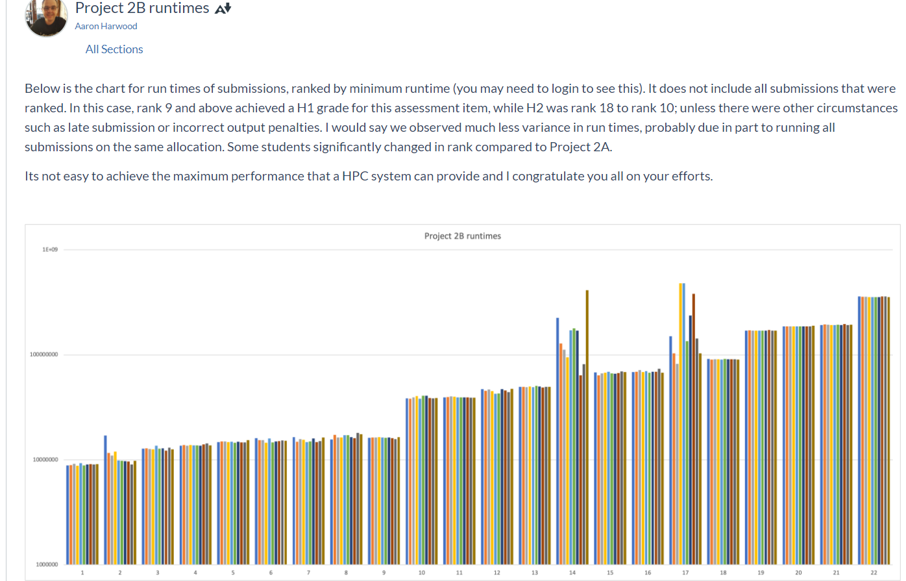

# multiple-sequence-alignment-openMP-openMPI
COMP90025 - Parallel and Multicore Computing - 2020S2 - Assignment2B

## specification
- [specification](./docs/Project2B.pdf)

## report
- [report](./docs/COMP90025_Assignment_02b.pdf)

## code submission
- [code](./submit/xuliny-seqalkway.cpp)

## result
- 8.6 out of 10 marks
- 
- 

## how to submit
- ``` mpicxx -std=c++14 -O3 -fopenmp -o xuliny-seqalkway xuliny-seqalkway.cpp ```
- ``` /data/gpfs/projects/punim0520/pmc/pub/bin/handin seqalkway xuliny-seqalkway.cpp 16 1  ```
- ``` /data/gpfs/projects/punim0520/pmc/pub/bin/handin seqalkway xuliny-seqalkway.cpp <cpus-per-task> <ntasks-per-node>  ```
    - ``` <cpus-per-task> ```
      - cores per process
    - ``` <ntasks-per-node> ```
      - processes per node
    - product of both <= 16
    - ```
      For example, you may have:
      CPUs per task = 4
      Tasks per node = 4
      Nodes = 12

      That means you are using 4×4 cores per node, so 4×4×12 cores total.
      ```
## how to run on wsl
- ``` mpicxx -std=c++14 -fopenmp -o a test.cpp -O3 ```
- ``` mpirun -np 4 a < mseq.dat > mseq.out ```
- ``` mpirun -np 4 a < mseq1.dat > parallel1_mseq1.out ```
## how to test
- ``` cd testing ```
- ``` sbatch run.slurm ```
